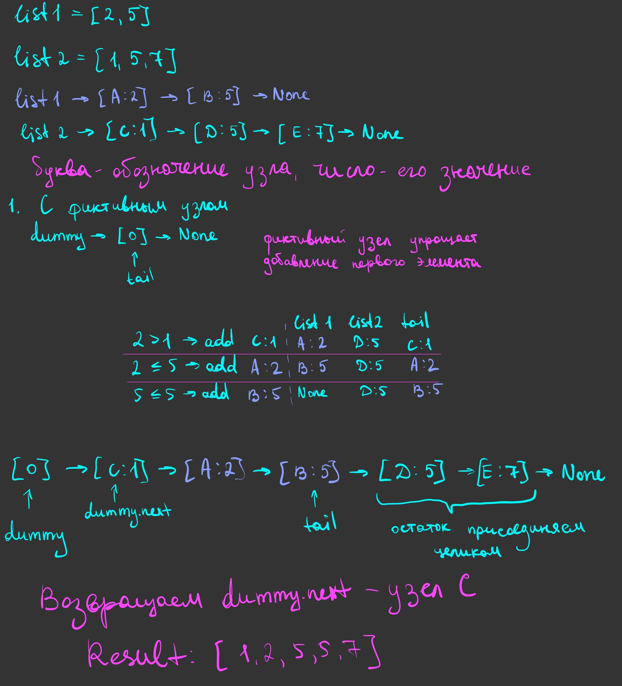
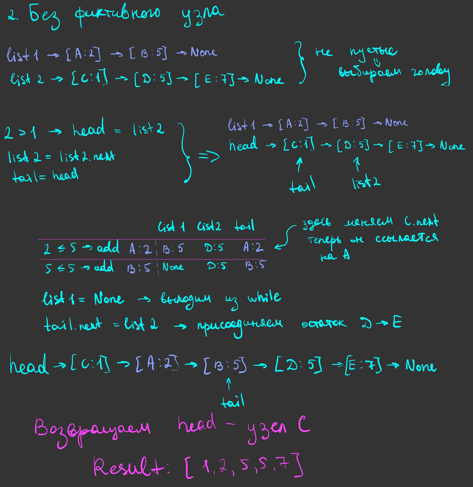

# Merge lists

## Объяснение решения

Решение сделано двумя способами: через функции `merge_with_dummy` и `merge_without_dummy`.

Обе функции получают головы двух отсортированных односвязных списков — `list1` и `list2`, возвращают голову объединённого отсортированного списка.

Результат собираем из исходных узлов: меняем ссылки между ними, значения не копируем.

### С фиктивным элементом — merge_with_dummy

- Создаём фиктивный узел `dummy = Node(0)`. Он нужен, чтобы первый узел результата присоединялся так же, как все остальные. Его значение не участвует в сравнениях.
- Заводим `tail = dummy` — ссылку на конец собираемого списка.
- Пока оба списка не пустые, сравниваем значения их текущих узлов.
- Если `list1.value <= list2.value`, присоединяем узел первого списка через `tail.next = list1`, затем переносим `list1` на следующий узел.
- Иначе так же присоединяем узел второго списка и переносим `list2`.
- После каждого присоединения переносим `tail` на добавленный узел.
- Когда один из списков закончился, присоединяем оставшуюся часть другого через `tail.next`.
- Возвращаем `dummy.next` — голову результата. Сам фиктивный узел в результат не входит.

Если один список изначально пустой, цикл не выполняется и сразу присоединяется второй список. Если оба пустые, возвращаем `None`.

### Без фиктивного элемента — merge_without_dummy

- Сначала проверяем пустые списки. Если `list1 = None`, возвращаем `list2`. Если `list2 = None`, возвращаем `list1`.
- Сравниваем значения первых узлов и выбираем меньший как голову результата `head`. При равных значениях выбираем узел первого списка.
- Переносим ссылку выбранного списка на следующий узел.
- Заводим `tail = head` — пока в результате один узел, он одновременно является головой и хвостом.
- Пока оба списка не пустые, сравниваем текущие узлы и присоединяем меньший через `tail.next`.
- Переносим ссылку того списка, из которого взяли узел, и обновляем `tail`.
- Когда один список закончился, присоединяем оставшуюся часть другого.
- Возвращаем `head`.

В этом способе первый узел выбираем отдельно, поэтому фиктивный узел не нужен.

### Почему результат отсортирован

Т.к. исходные списки отсортированы, в начале каждого из них находится наименьший из оставшихся элементов. На каждом шаге выбираем меньший из этих двух узлов — значит, добавляем наименьший из всех оставшихся элементов.

Когда один список заканчивается, остаток другого уже отсортирован, а его значения не меньше последнего добавленного. Поэтому его можно присоединить целиком.

Каждый исходный узел попадает в результат один раз. Узлы с одинаковыми значениями тоже сохраняются.

## Оценка сложности

Пусть `n` — количество узлов первого списка, а `m` — второго.

**Время — O(n + m) в худшем случае** для обоих способов.

На каждом шаге переносим один узел в результат и продвигаемся по одному из списков. Повторно узлы не обрабатываем. Оставшуюся часть списка присоединяем за O(1), без обхода.

**Дополнительная память — O(1)** для обоих способов.

Новые узлы для хранения элементов результата не создаём, используем исходные. Храним только фиксированное количество ссылок.

В `merge_with_dummy` дополнительно создаём один фиктивный узел. Он занимает O(1) памяти, поэтому общая оценка дополнительной памяти остаётся O(1).

## Визуализация работы

