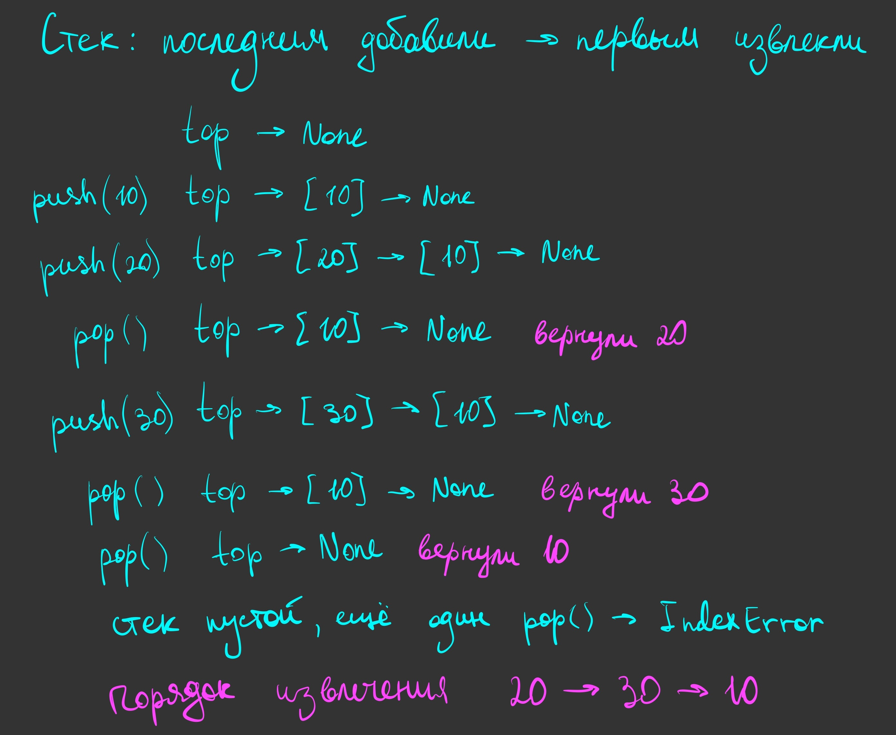
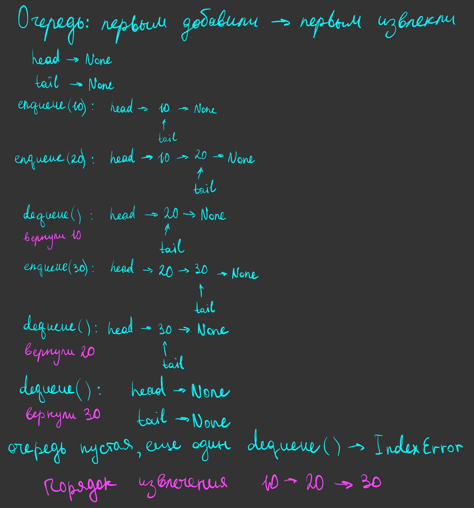

# Stack vs queue

## Объяснение решения

Решение сделано через классы `Stack` и `Queue`. Обе структуры реализованы на основе односвязного списка.

Для элементов списка создан класс `Node`: в `value` храним значение, а в `next` — ссылку на следующий узел. У последнего узла `next = None`.

### Stack

Стек работает по принципу LIFO: последний добавленный элемент извлекается первым.

В `top` храним ссылку на вершину стека. При создании стек пустой, поэтому `top = None`.

Как работает добавление — `push(value)`:

- Создаём новый узел со значением `value`.
- В его `next` записываем ссылку на текущую вершину.
- Переносим `top` на новый узел — теперь он стал вершиной.

Как работает извлечение — `pop()`:

- Сначала проверяем, не пуст ли стек. Если `top = None`, вызываем ошибку `IndexError`.
- Сохраняем значение вершины в переменную `value`.
- Переносим `top` на следующий узел через `self.top.next`.
- Возвращаем сохранённое значение.

Т.к. каждый новый узел становится вершиной, а извлекаем мы тоже из вершины, последним добавленный элемент будет извлечён первым. После извлечения последнего элемента `top` становится `None`.

### Queue

Очередь работает по принципу FIFO: первый добавленный элемент извлекается первым.

В `head` храним ссылку на начало очереди, в `tail` — на конец. При создании обе ссылки равны `None`.

Как работает добавление — `enqueue(value)`:

- Создаём новый узел со значением `value`. Его `next = None`, т.к. он будет последним.
- Если очередь пустая, записываем ссылку на новый узел и в `head`, и в `tail`.
- Иначе связываем текущий хвост с новым узлом через `self.tail.next`, затем переносим `tail` на новый узел.

Как работает извлечение — `dequeue()`:

- Сначала проверяем, не пуста ли очередь. Если `head = None`, вызываем ошибку `IndexError`.
- Сохраняем значение первого узла в переменную `value`.
- Переносим `head` на следующий узел через `self.head.next`.
- Если после этого `head = None`, очередь опустела. Тогда `tail` тоже делаем равным `None`.
- Возвращаем сохранённое значение.

Т.к. добавляем элементы в конец, а извлекаем из начала, раньше добавленные элементы извлекаются раньше остальных.

## Оценка сложности

**Время — O(1) для каждой операции** `push`, `pop`, `enqueue`, `dequeue`.

Каждая операция обращается к фиксированному количеству узлов и меняет несколько ссылок. Весь список обходить не нужно. Для добавления в конец очереди используем ссылку `tail`.

**Память для хранения каждой структуры — O(n)**, где `n` — количество элементов в ней.

Для каждого элемента создаём отдельный узел со значением и ссылкой на следующий узел.

**Дополнительная память на одну операцию — O(1)**.

Используем фиксированное количество переменных, а при добавлении создаём один новый узел.

## Визуализация работы

