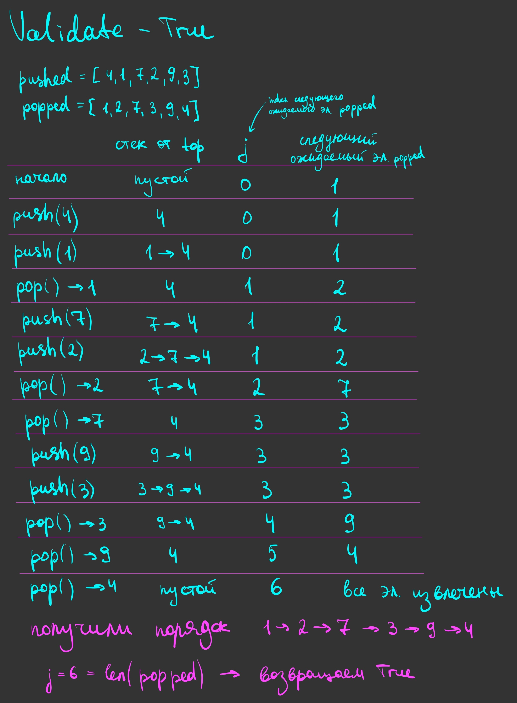
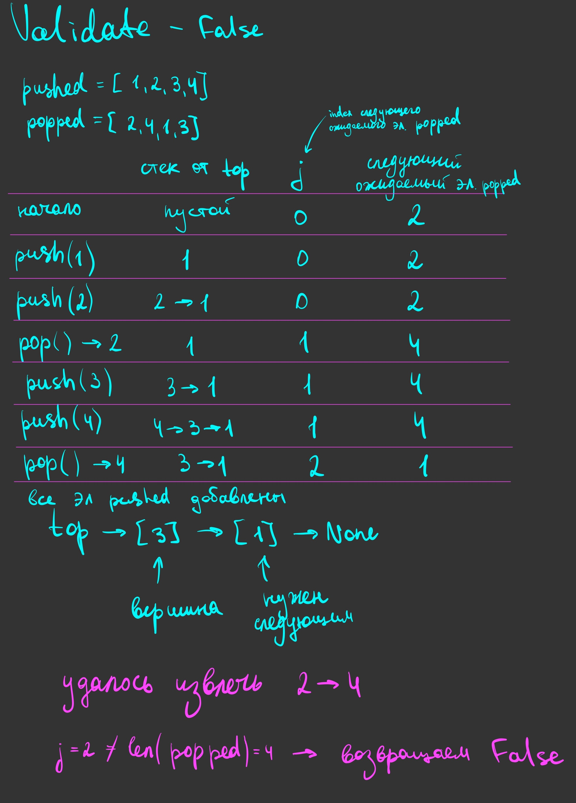

# Validate

## Объяснение решения

Решение сделано через функцию `validate`. Функция получает две последовательности — `pushed` и `popped`, возвращает `True`, если такой порядок добавлений и извлечений возможен, иначе — `False`.
По условию элементы уникальны, а `popped` является перестановкой `pushed`.

### Как работает функция

- Создаём пустой стек `stack`, используя класс `Stack` из первой задачи.
- Заводим переменную `j = 0` — индекс следующего элемента из `popped`, который нужно извлечь.
- Проходим циклом по `pushed` и добавляем каждый элемент в стек через `push`.
- После каждого добавления проверяем вершину: пока стек не пустой и значение вершины совпадает с `popped[j]`, извлекаем элемент через `pop` и увеличиваем `j` на 1.
- За одно добавление может произойти несколько извлечений подряд: после удаления вершины следующий узел тоже может совпасть с ожидаемым элементом.
- Когда прошли весь `pushed`, сравниваем `j` с длиной `popped`. Если они равны, все элементы извлечены в нужном порядке — возвращаем `True`. Иначе возвращаем `False`.

Т.к. из стека можно извлечь только вершину, следующий элемент из `popped` должен находиться именно на ней. Если он уже на вершине, можем сразу его извлечь. Если нет, продолжаем добавлять элементы из `pushed`.

После окончания добавлений все возможные совпадения уже извлечены циклом `while`. Если часть `popped` осталась необработанной, нужный элемент закрыт другим узлом и получить заданный порядок нельзя.

## Оценка сложности

**Время — O(n)**, где `n` — длина `pushed`.

По `pushed` проходим один раз. Каждый элемент добавляем в стек один раз и извлекаем не больше одного раза. Поэтому, несмотря на вложенный `while`, суммарное количество операций линейно. Каждая операция стека занимает O(1).

**Дополнительная память — O(n)**.

В худшем случае в стеке одновременно находятся все `n` элементов. Например, когда `popped` содержит элементы в обратном порядке относительно `pushed`: сначала нужно добавить их все и только потом начать извлечение.

## Визуализация работы

